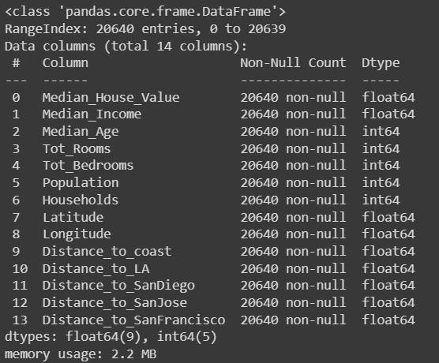
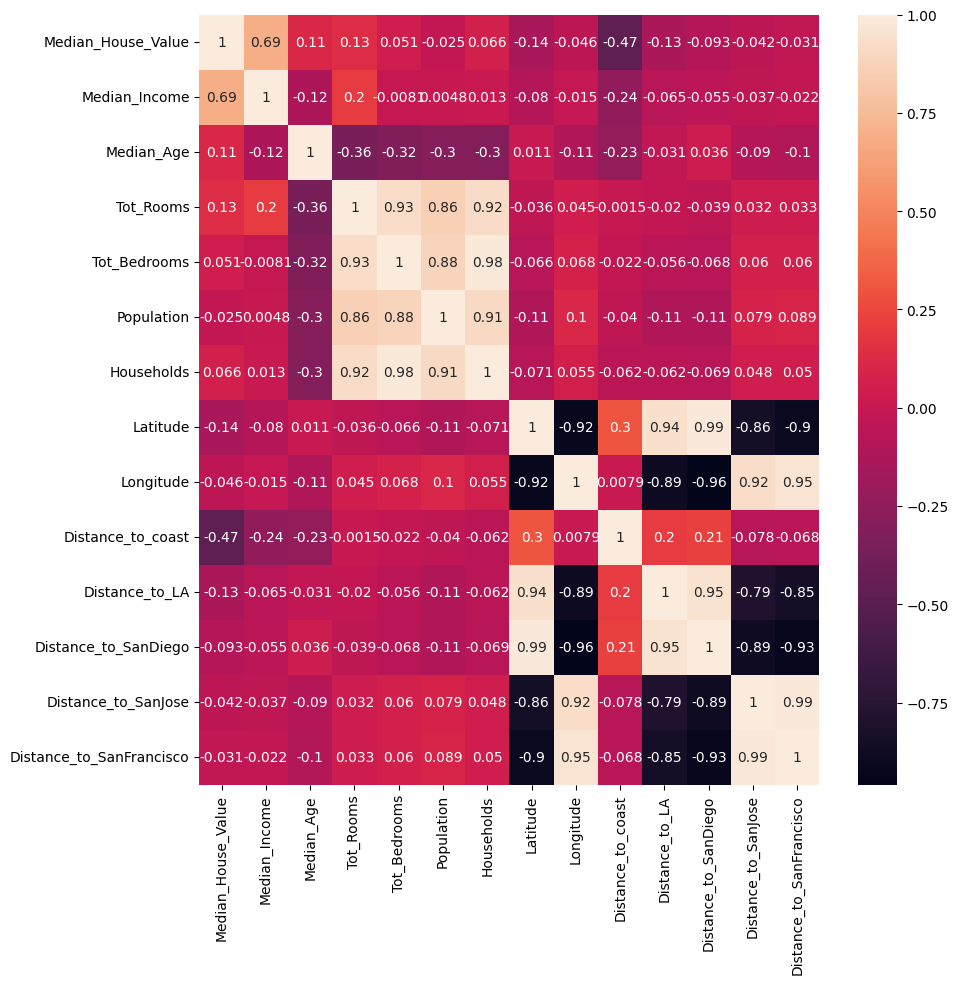
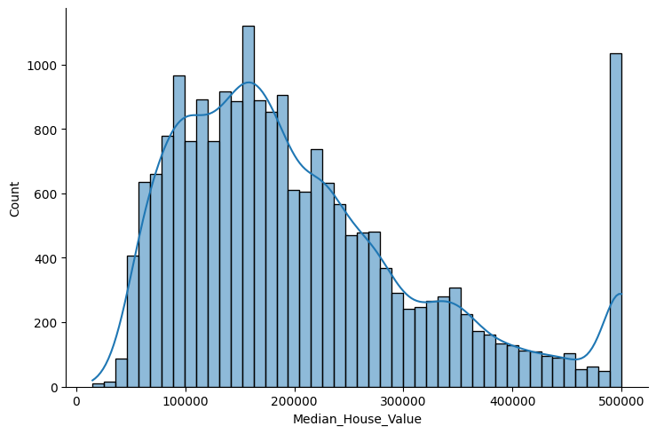

## Dataset selection

The dataset we selected for this project is the California Housing Prices Data, which can be found in the following [link](https://www.kaggle.com/datasets/fedesoriano/california-housing-prices-data-extra-features).

The reason we selected this dataset is because it has a great variety of variables that we can work with, making it a great tool for learning predictive machine learning algorithms. Also, this could have applications in real life scenarios, for example, building companies could benefit of a model that could predict the value of a house given the variables, using this to evaluate the potential profitability of a building. This could also be used by potential home buyers to estimate a price for a house given the characteristics that they want in that house.

## Visualization and statistical insights

Using Google Colab, we constructed some plots that helped us to gain some statistical insights of our dataset, the code that generates each image can be found in the [Visualization Code](./visualizationcode) page, with this we gathered some information from the dataset to get better statistical insights:

Firstly, we took a look into the information that pandas provides us about the dataset, in this we can see that all 14 rows have all non-null values, which is great, because we don't have any gaps in the information and don't have to make any decisions about what we should do about missing values. Also, we can see that all variables are numerical, either integers or floats, so our models won't depend on any categorical values, so we won't need to drop any of this information or build a different model depending on the categorie (because sometimes they are incompatible).

Histogram: With this plot, we aimed to take a look at the distribution of frecuency of the house prices, which is our variable of interest, and the one we will try to predict in the future. For this we decided to change the amount of bins (which is 10 by default) to the amount proposed by the Sturges law, this is automatically done by pyplot, and we can see that there is a tendency for a shift to the left in the prices of the houses, and also an unusual amount in the last bin, with this we can rule out that the houses have a well defined probability distribution.

Correlation Heat Map: Using pandas, we calculated the correlation between all of the variables, our interest is centered in the ones that are placed in the first row, because they are related to our variable of interest. In this we see that the most influential parameter is the median income of households around the area, which makes sense because we would normally expect an expensive house to be located in an expensive neighborhood, so the correlation is clear. The second biggest correlation is with the distance to the coast, which is surprising because it has a big negative correlation, so the further away a house is from the coast, its going to be more expensive, and we thought that it wouldn't have a lot of impact. The rest of the variables

Displot: The displot shows both the histogram plot and a kde plot, the kde shows a prediction of the probability distribution based on the behavior of the data, again confirming that it doesn't follow conventional probability distributions.

Scatter and Kde Plot: We created a pair grid of Scatter and Kde plots, the first one helps us visualize the pattern of frecuency of the different variables in our set, in which we can clearly observe how correlated these are in the variability of the plots, the Kde on the other hand shows how the gradient of that two variable function of frecuency behaves, showing that for some variables we have a lot of critical points of concentration, which could probably be used for neural networks algorithms.

## Hypothesis 

Out of the statistical insights we got of the dataset, we would like to explore the idea of working with the different variables we have to construct a predictive machine learning model, using the correlation between the data to our advantage to predict the prices of a hose given user input, as well as considering creating predictive models for other variables like the median income in the zone, which are most likely unknown by a normal user who's looking to buy a house, especially because we saw that the median income had the biggest correlation to the price.

We would also like to check how different machine learning algorithms perform given the dataset, identifying the key differences that make one model perform better than the others.

That said, the main objective of this project is to learn the implementation of different machine learning algorithms in Python, using the patterns in data to create predictive models that could be useful in real life scenarios.

## [Go back to Main Page](./)