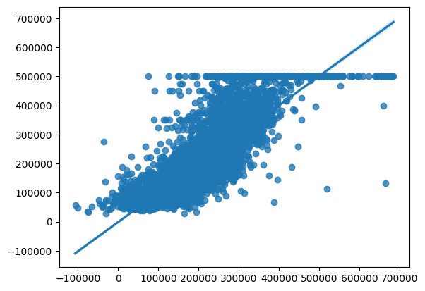

## Linear Regression

For our first model, we used linear regression to predict the pricing of the houses. For this, we used the scikit learn library from python, the code used for this part can be found [here](./model1code).

We predicted the Median_House_Value column using the other 13 columns of the dataset, which all had numerical values, applying the linear regression, we got the following parameters:

- Median_Income: 3.93020390e+04
- Median_Age: 9.21787349e+02
- Tot_Rooms: -6.37930844e+00
- Tot_Bedrooms: 1.13579185e+02
- Population: -3.49795266e+01
- Households: 2.80108601e+01
- Latitude:-4.44119437e+04
- Longitude: -2.89682814e+04
- Distance_To_Coast: -2.26101437e-01
- Distance_To_LA: -1.35384997e-01
- Distance_To_SanDiego: 2.22176457e-01
- Distance_To_SanJose: 1.53847973e-01
- Distance_To_SanFrancisco: -1.28849908e-01

And the intercep of the model is

- Intercept: -1907956.16322239

Out of this values, we got the following score:

- Regression Score: 0.6473127028039991

Which shows that the regression model is far from accurate to the real distribution of data, we can clearly see this with the regression plot given by comparing the predicted values with the actual values.

In this plot, we can see a great amount of dispersion in the points, although we think that the behavior of the regression is sufficiently good to make predictions and get a decent result, but there should be a better model to apply to the dataset that gives a more accurate representation of the data, so in the next model we're going to try to get a better result with another technique.

## [Go back to Main Page](./)
