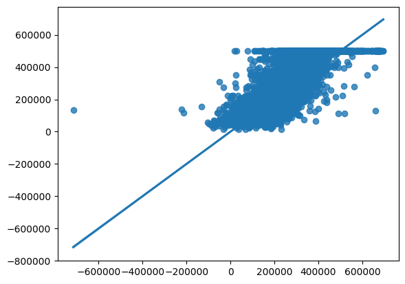

```python
import pandas as pd
from sklearn.model_selection import train_test_split
from sklearn.linear_model import LinearRegression
import seaborn as sns
```

```python
df = pd.read_csv("/content/California_Houses.csv")
df.columns
```

Output: ['Median_House_Value', 'Median_Income', 'Median_Age', 'Tot_Rooms','Tot_Bedrooms', 'Population', 'Households', 'Latitude', 'Longitude','Distance_to_coast', 'Distance_to_LA', 'Distance_to_SanDiego', 'Distance_to_SanJose', 'Distance_to_SanFrancisco']

```python
dfTrain, dfTest = train_test_split(df, test_size=0.3, random_state=10)
regression = LinearRegression()
regression.fit(dfTrain[inputs], dfTrain[output])
```

```python
regression.coef_
```

Output: [ 3.93020390e+04, 9.21787349e+02, -6.37930844e+00, 1.13579185e+02, -3.49795266e+01, 2.80108601e+01, -4.44119437e+04, -2.89682814e+04, -2.26101437e-01, -1.35384997e-01, 2.22176457e-01, 1.53847973e-01, -1.28849908e-01]

```python
regression.intercept_
```

Output: -1907956.16322239

```python
regression.score(dfTest[inputs], dfTest[output])
```

Output: 0.6473127028039991

```python
ypred = regression.predict(dfTest[inputs]).flatten()
yactu = dfTest[output].values
sns.regplot(x=ypred, y=yactu)
```

Output:

