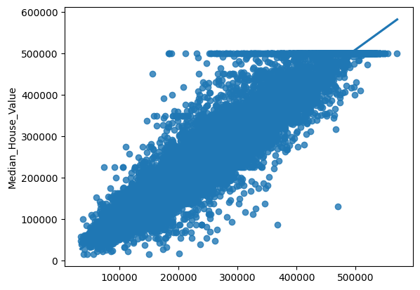

## eXtreme Gradient Boosting (XGBRegressor)

For our second model, we decided to use XGBRegressor, which is a tree-based regression model from the xgboost library, an open source project sponsored by Nvidia and Intel, see [Github Repo here](https://github.com/dmlc/xgboost). This model utilizes an ensemble of decission trees and utilizes gradient boosting techniques to build a robust predictive model.

We decided to use XGBRegressor after trying with different options, such as Ridge and Lasso regressions (which are optimized linear regressions), and even MLP regressors, which were very computationally expensive, but after trying all of the different options, the model with the best performance was the XGB, so that's why we decided it was the best fit for our model.

After researching some more, we found out that gradient boosted decision trees usually outperform neural networks when working with tabular data, such as the dataset we're using, there are multiple studies made with the purpose of benchmarking tree models and neural networks, showing that the decision trees models are superior, such as _Why do tree-based models still outperform deep learning on tabular data?_ by Grinsztajn, Oyallon and Varoquax, this study was conducted by the university of Cornell, link found [here](https://arxiv.org/abs/2207.08815), one of the most interesting benchmarks is the following:

In this figure, we can see how XGBoost severely outperforms deep learning algorithms like MLP, Resnet and and FT Transformer, while also being considerably faster to train, as we experienced.

## How XGBRegressor works

Firsly, XBG uses decision trees as base learners, which are binary trees that split the data into two groups depending on a certain condition applied to one of the input features. A great visualization of this process is provided by [datacamp](https://www.datacamp.com/tutorial/guide-to-the-gradient-boosting-algorithm), where one decision tree may look like this:

Were we have an initial guess (in this case the average output) and using a decision tree we modify a certain quantity that initial guess. For a full explanaiton of how gradient boosting algorithms work, we reccomend to follow the [datacamp tutorial](https://www.datacamp.com/tutorial/guide-to-the-gradient-boosting-algorithm) about this topic.

We construct multiple decision trees in the model, and this is where the "boosting" part of the algorithm is present. the gradient boosting refers to the creation of a differentiable loss function, which is the optimization target, trying to minimize it so that we have the best conditions and the best adjustment possible in each decision tree. For the construction of the loss function we use the difference between the predicted and actual values, fitting the next generation of trees the residuals of the previous generation, similar to how we define it in other machine learning models, using the Hessian Matrix to create the next best estimate.

Also, we wanted to highlight the efficiency of this model, which wasn't as fast to train as a linear regression (which was expected for the extra steps needed) but was much faster than MLPRegressor, specially taking into account it had a better performance, this is thanks to the library being constructed with advanced optimization techniques, as well as efficient data structures and algorithms, making it highly efficient and scalable.

## Our Implementation

To see the code in full detail, click [here](./model2code.md).

For the decision of the parameters to build the model, we tried different combinations and finally decided for the following:

- objective: 'reg:squarederror' (Usually used for regression models)
- n_estimators: 200 (Number of gradient boosted trees to be used)
- learning_rate: 0.1 (Represents a size shrinkage to prevent overfitting)
- max_depth: None (Maximum depth of each tree, None let's the model decide the best)
- alpha: 10 (L1 regularization term that minimizes overfitting by penalizing larger weigths)
- colsample_bytree: 0.3 (Controls the fraction of features (columns) that are randomly sampled for each tree.)

After choosing our parameters, we ran 100 different cross validations, changing the random state, with a training size of 30%, saving the score of the model in each iteration. Using this, we got an idea of the score distribution of the model.

As seen in the image, the score distribution is centered around 0.84, having an average of 0.8430300403873011, which is a great improvement when compared to our previous model, it also has a very small dispersion, so we think that it does a great job at predicting the behavior of the data.

After calculating these scores, we had to choose the final model, for this we iterated through the different train/test splits to find one that had an score similar to the average in 4 decimal places, using that one as the final model to make the predictions.

With this trained model, we created a regression plot to show the dispersion between the real values of the pricing vs the predicted by the model, this resulted in the following plot:

Compared to the linear regression model, we got much less dispersion, less outliars and overall a better performance, so we concluded that we chose the best possible fit to solve the problem of predicting the housing prices.

## [Go back to Main Page](./)
