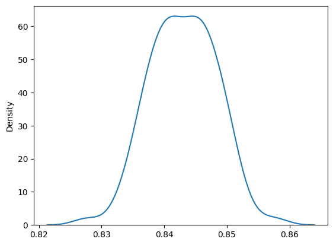
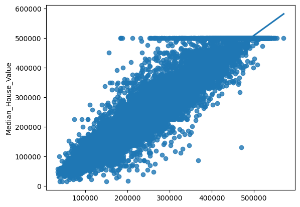

```python
import pandas as pd
from sklearn.model_selection import train_test_split
from xgboost import XGBRegressor
import seaborn as sns
```

```python
df = pd.read_csv("/content/California_Houses.csv")
df.columns
```

Output: ['Median_House_Value', 'Median_Income', 'Median_Age', 'Tot_Rooms','Tot_Bedrooms', 'Population', 'Households', 'Latitude', 'Longitude','Distance_to_coast', 'Distance_to_LA', 'Distance_to_SanDiego', 'Distance_to_SanJose', 'Distance_to_SanFrancisco']

```python
inputs = ['Median_Income', 'Median_Age', 'Tot_Rooms',
       'Tot_Bedrooms', 'Population', 'Households', 'Latitude', 'Longitude',
       'Distance_to_coast', 'Distance_to_LA', 'Distance_to_SanDiego',
       'Distance_to_SanJose', 'Distance_to_SanFrancisco']
output = ['Median_House_Value']
```

```python
score = []
n = 100
xgb_reg = XGBRegressor(objective ='reg:squarederror', n_estimators=200, learning_rate=0.1, max_depth=None, colsample_bytree = 0.3, alpha = 10)
for state in range(n):
  dfTrain, dfTest = train_test_split(df, test_size=0.3, random_state=state)
  xgb_reg.fit(dfTrain[inputs], dfTrain[output])
  score.append(xgb_reg.score(dfTest[inputs], dfTest[output]))
```

```python
sns.kdeplot(score)
```

Output:


```python
avg_score = sum(score)/len(score)
avg_score
```

Output: 0.8430300403873011

```python
for state in range(n):
  dfTrain, dfTest = train_test_split(df, test_size=0.3, random_state=state)
  xgb_reg.fit(dfTrain[inputs], dfTrain[output])
  if abs(xgb_reg.score(dfTest[inputs], dfTest[output])-avg_score) < 1e-4:
    break
```

```python
sns.regplot(x=xgb_reg.predict(df[inputs]), y=df[output])
```

Output:

