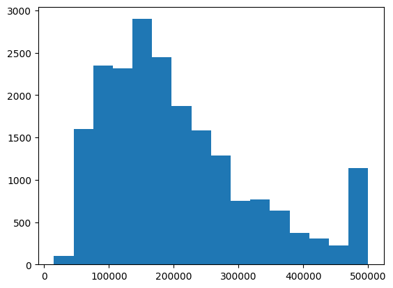

```python
import numpy as np
import matplotlib.pyplot as plt
import seaborn as sns
import pandas as pd
```

```python
df = pd.read_csv("California_Houses.csv")
```

```python
print(df.info())
```
Output:


```python
plt.hist(df["Median_House_Value"], bins="sturges")
plt.show()
```
Output:



```python
plt.figure(figsize=(10,10))
sns.heatmap(df.corr(), annot=True)
```
Output:


```python
sns.displot(df["Median_House_Value"], kde=True, height=5, aspect=1.5)
```

Output:


```python
sns.set_theme(style="white")

g = sns.PairGrid(df, diag_sharey=False)
g.map_upper(sns.scatterplot, s=15)
g.map_lower(sns.kdeplot)
g.map_diag(sns.kdeplot, lw=2)
```

Output:


## [Go back to Dataset Selection Page](./datasetinfo)